# 💰 สมุดเงิน (sood-ngern)

แอปบันทึกรายรับ-รายจ่ายส่วนตัวและแบบ **สมุดบัญชีร่วมกับคนอื่น** พัฒนาด้วย React + TypeScript และ Firebase
ข้อมูลอัปเดตแบบ Realtime, ล็อกอินด้วย Google, รองรับ Light/Dark mode และใช้งานได้ทั้งคอมพิวเตอร์และมือถือ

**🌐 ใช้งานจริง:** https://money-7d89c.web.app

<p align="left">
  
  
  
  
  
  
</p>

---

## 📸 ภาพหน้าจอ

> ภาพทั้งหมดถ่ายจากข้อมูลตัวอย่าง (ผู้ใช้สมมติ Alice / Bob / Carol) ไม่ใช่ข้อมูลจริงของใคร

### เดสก์ท็อป

| ภาพรวม (Light) | ภาพรวม (Dark) |
|---|---|
| 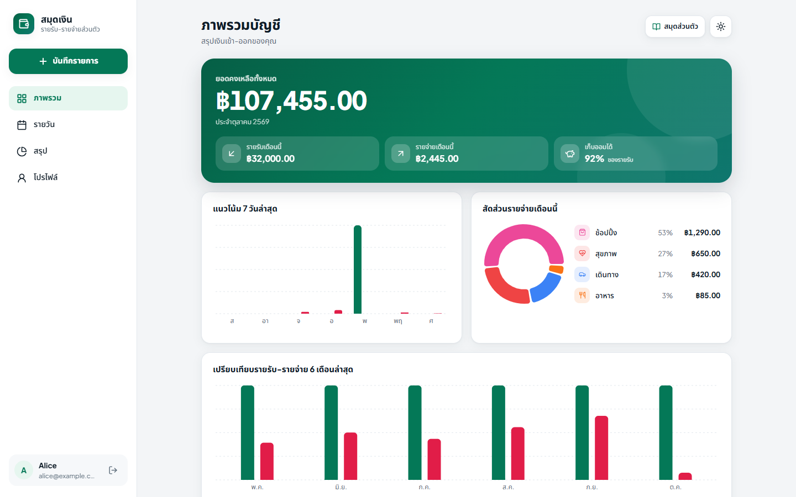 | 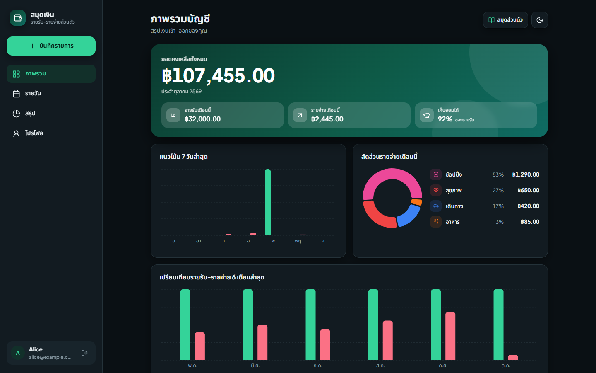 |
| **บันทึกรายการ** | **สรุปรายสัปดาห์/เดือน** |
| 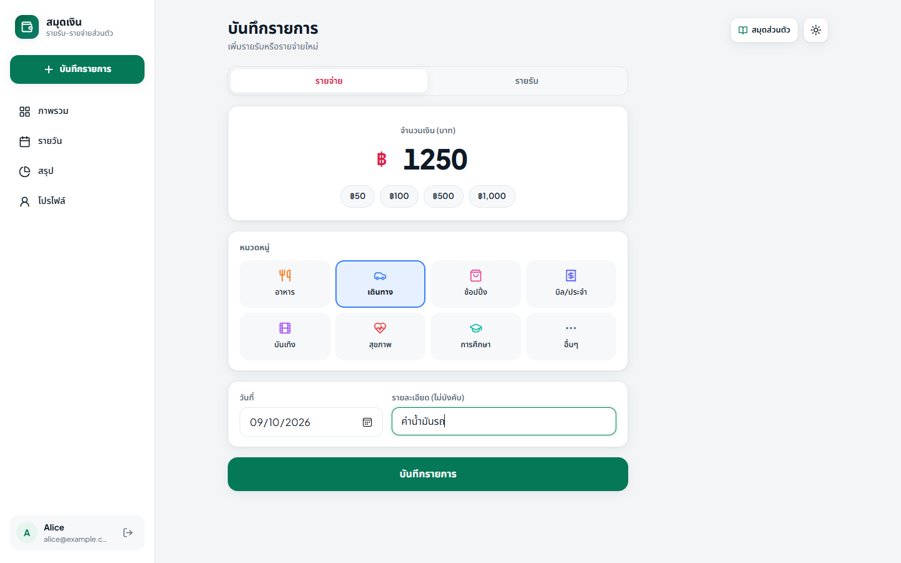 | 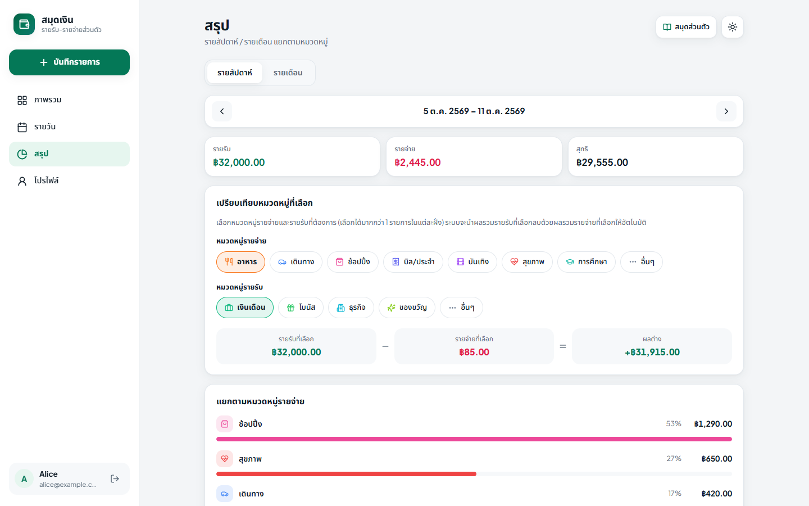 |
| **รายวัน** | **สมุดร่วม — เจ้าของอนุมัติสมาชิก** |
| 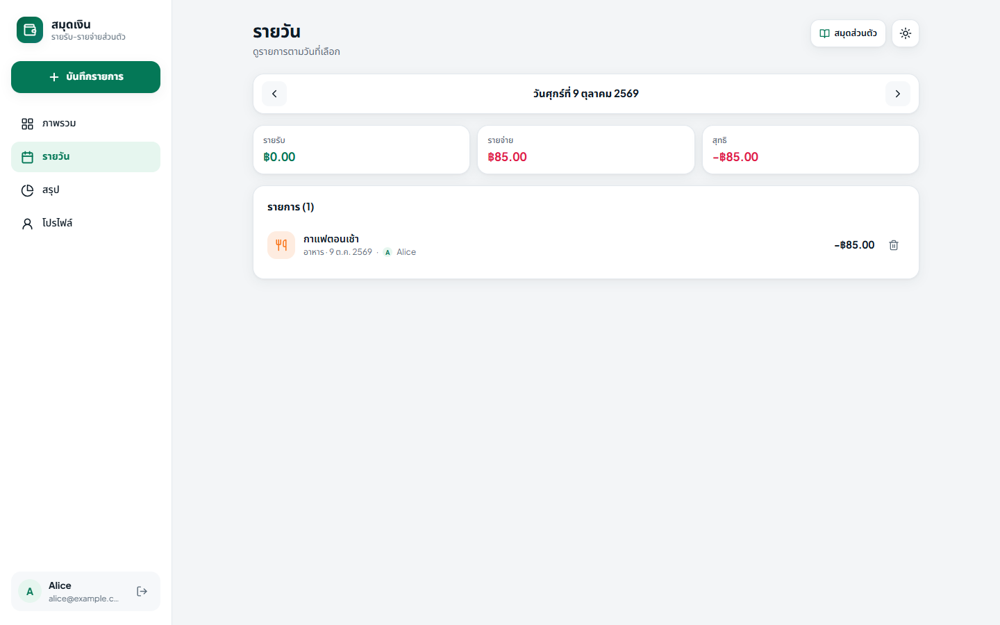 | 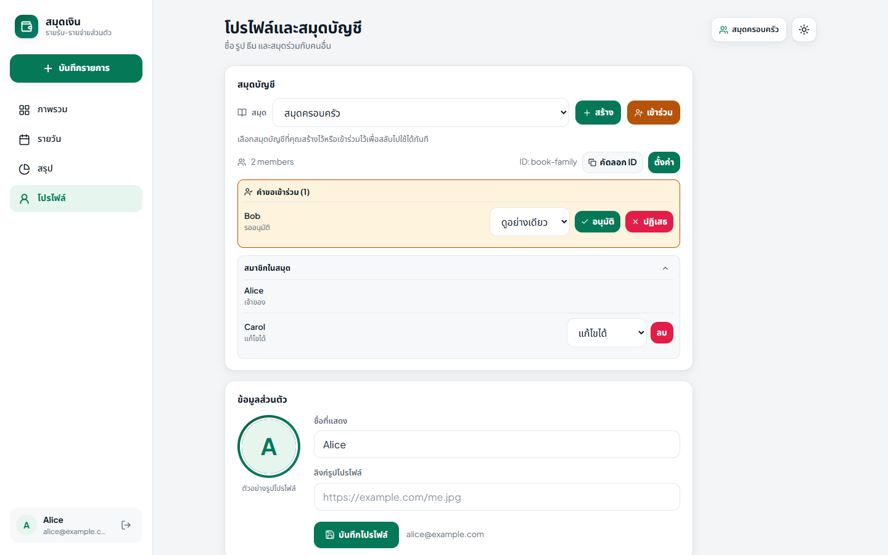 |

### มือถือ

| ภาพรวม | บันทึกรายการ | ภาพรวม (Dark) | ลบบัญชี |
|---|---|---|---|
| 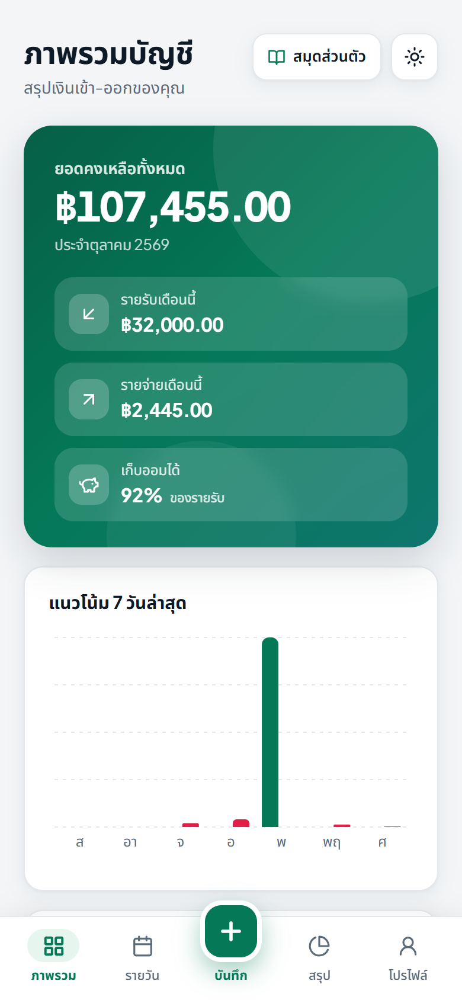 | 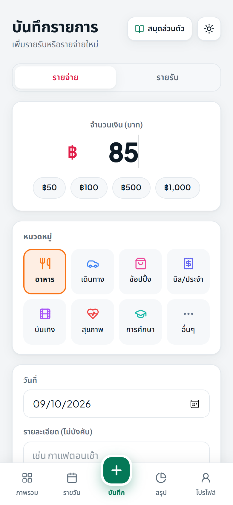 | 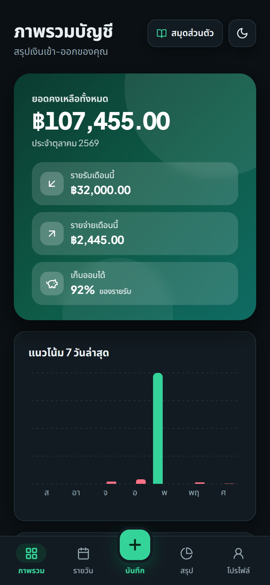 | 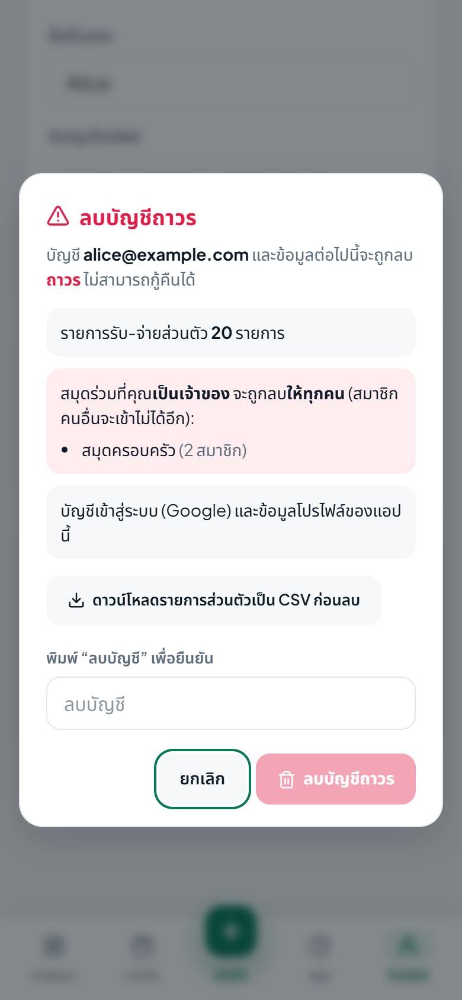 |

### เข้าสู่ระบบ

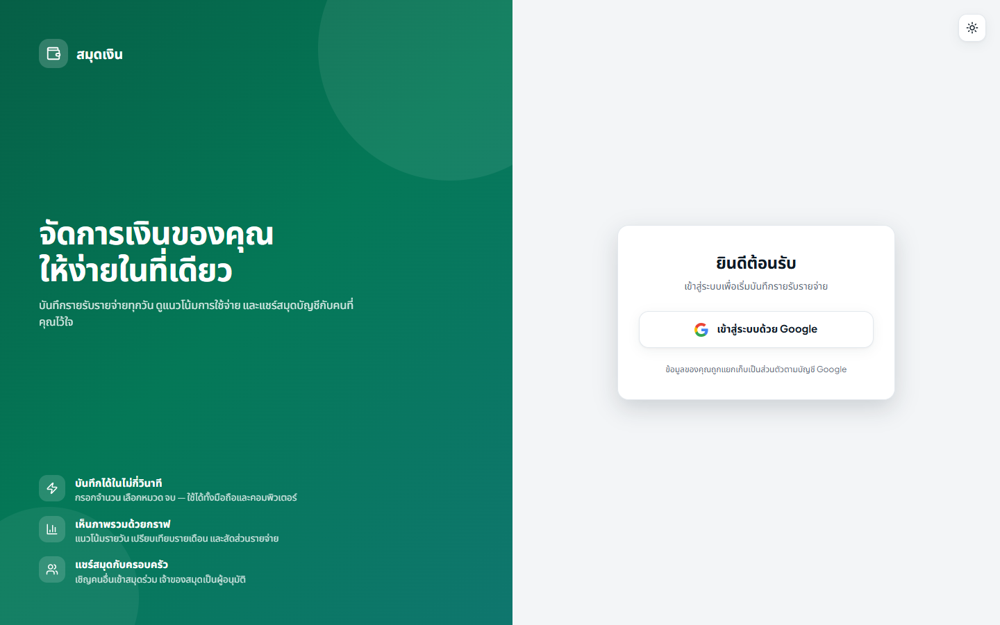

---

## ✨ ฟีเจอร์

| หมวด | รายละเอียด |
|---|---|
| 🔐 บัญชี | ล็อกอินด้วย Google, แก้ชื่อ/รูปโปรไฟล์, **ลบบัญชีและข้อมูลทั้งหมดได้เองในแอป** |
| 💸 บันทึก | รายรับ/รายจ่าย 13 หมวดหมู่ พร้อมหมายเหตุ, ปุ่มจำนวนเงินลัด |
| 📊 วิเคราะห์ | Dashboard (ยอดคงเหลือ, % เก็บออม, กราฟ 7 วัน / 6 เดือน, สัดส่วนรายจ่าย), มุมมองรายวัน, สรุปรายสัปดาห์/เดือน, เปรียบเทียบหมวดหมู่ที่เลือก |
| 👥 สมุดร่วม | สร้างสมุดแชร์กับครอบครัว/เพื่อน, **เจ้าของอนุมัติคำขอเข้าร่วม**, สิทธิ์ Owner / Editor / Viewer |
| ⚡ Realtime | ข้อมูลอัปเดตทันทีทุกอุปกรณ์ผ่าน Firestore |
| 🎨 ดีไซน์ | Modern Fintech, Light/Dark (ตามระบบหรือเลือกเอง), Responsive พร้อมแถบเมนูล่างบนมือถือ |
| ♿ การเข้าถึง | focus ring, label ของปุ่มไอคอน, ปิด dialog ด้วย Esc, เคารพ `prefers-reduced-motion` |

---

## 🏗️ สถาปัตยกรรม

แอปเป็น Single-Page App ที่คุยกับ Firebase โดยตรงจากเบราว์เซอร์ ไม่มี backend ของตัวเอง
ความปลอดภัยทั้งหมดจึงบังคับด้วย **Firestore Security Rules** (ทดสอบอัตโนมัติ 27 กรณี)

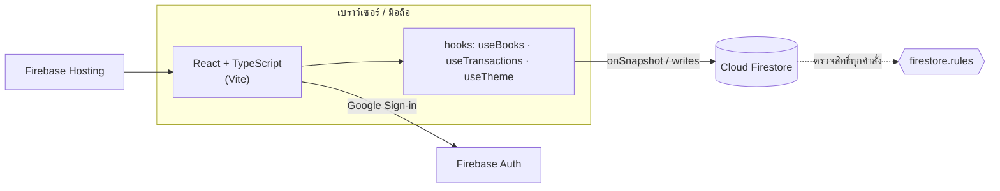

**Tech stack:** React 18, TypeScript 5 (strict), Vite 5, Recharts, lucide-react, Firebase (Auth, Firestore, Hosting, Analytics), Vitest + Firestore Emulator

### โมเดลข้อมูล (Firestore)

```
users/{uid}/transactions/{txId}          รายการส่วนตัว (เจ้าของคนเดียวเข้าถึงได้)

books/{bookId}                           สมุดร่วม — อ่านได้เฉพาะสมาชิก
  name, ownerUid, ownerName, createdAt, updatedAt, deleted?
  memberIds: string[]                    ใช้กรองด้วย array-contains
  members: { [uid]: { name, photoURL, role, joinedAt } }
books/{bookId}/transactions/{txId}       รายการในสมุดร่วม
books/{bookId}/joinRequests/{uid}        คำขอเข้าร่วม (doc id = uid ผู้ขอ)
```

### สิทธิ์ในสมุดร่วม

| การกระทำ | Owner | Editor | Viewer | คนนอก |
|---|:-:|:-:|:-:|:-:|
| ดูสมุดและรายการ | ✅ | ✅ | ✅ | ❌ |
| เพิ่ม/แก้/ลบรายการ | ✅ | ✅ | ❌ | ❌ |
| อนุมัติ/ปฏิเสธคำขอ, เปลี่ยนสิทธิ์, ลบสมาชิก, เปลี่ยนชื่อ, ลบสมุด | ✅ | ❌ | ❌ | ❌ |
| ออกจากสมุด | ❌ (ต้องลบสมุด) | ✅ | ✅ | – |
| ส่งคำขอเข้าร่วม | – | – | – | ✅ (ต้องรู้ ID สมุด) |

**การเข้าร่วมสมุด:** เจ้าของกด "คัดลอก ID" ส่งให้เพื่อน → เพื่อนกด *เข้าร่วม* ใส่ ID → เจ้าของเห็นคำขอในหน้าโปรไฟล์ แล้ว *อนุมัติ* (เลือก Viewer/Editor) หรือ *ปฏิเสธ*
ไม่มีรหัสผ่านเก็บในฐานข้อมูล — คนนอกจึงอ่านสมุดไม่ได้เลยแม้รู้ ID

---

## 🔒 ความปลอดภัยและความเป็นส่วนตัว

- ข้อมูลส่วนตัวแยกตาม `uid`; สมุดร่วมอ่านได้เฉพาะสมาชิก; เจ้าของเป็นผู้เดียวที่อนุมัติสมาชิก
- ตรวจรูปแบบข้อมูลฝั่ง server (ประเภท จำนวนเงิน ความยาวข้อความ URL รูป) และห้ามเปลี่ยนผู้สร้างรายการ
- ชุดทดสอบ `tests/firestore.rules.test.ts` ครอบคลุม **27 กรณี** เช่น คนนอกอ่านสมุด/ใส่ตัวเองเป็นสมาชิกไม่ได้, Viewer เขียนไม่ได้, สมาชิกลบคนอื่นหรือเลื่อนสิทธิ์ตัวเองไม่ได้
- รายละเอียดเชิงลึก: [docs/SECURITY.md](docs/SECURITY.md) · นโยบายความเป็นส่วนตัว: [`/privacy.html`](public/privacy.html)

> แอปใช้ **Firebase Analytics** เก็บสถิติการใช้งานแบบไม่ระบุตัวตน (ระบุไว้ในนโยบายความเป็นส่วนตัวแล้ว)

---

## 🗑️ การลบบัญชี (Account deletion)

ผู้ใช้ลบบัญชีเองได้ที่ **โปรไฟล์ → ลบบัญชี** ตามข้อกำหนดของ Apple App Store และ Google Play

| ภาพ | ขั้นตอน |
|---|---|
| 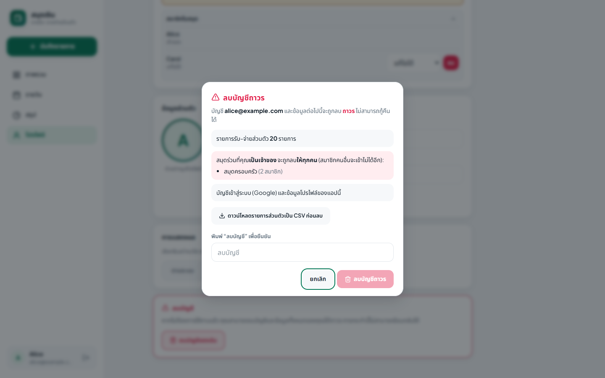 | **1. สรุปให้ก่อนลบ** แสดงว่าจะเกิดอะไรขึ้น: จำนวนรายการส่วนตัว, สมุดที่เป็นเจ้าของ (ลบให้ทุกคน), สมุดที่เป็นสมาชิก (ถูกนำออก) พร้อมปุ่มดาวน์โหลด CSV ก่อนลบ |
| 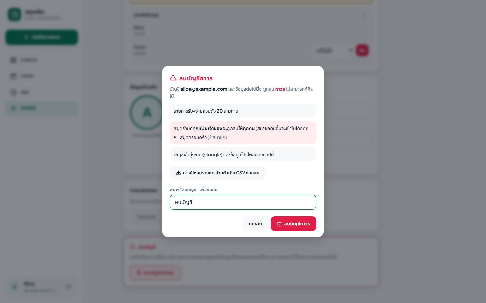 | **2. พิมพ์ "ลบบัญชี" เพื่อยืนยัน** ปุ่มลบจะเปิดใช้งานเมื่อพิมพ์ถูกต้องเท่านั้น |
| 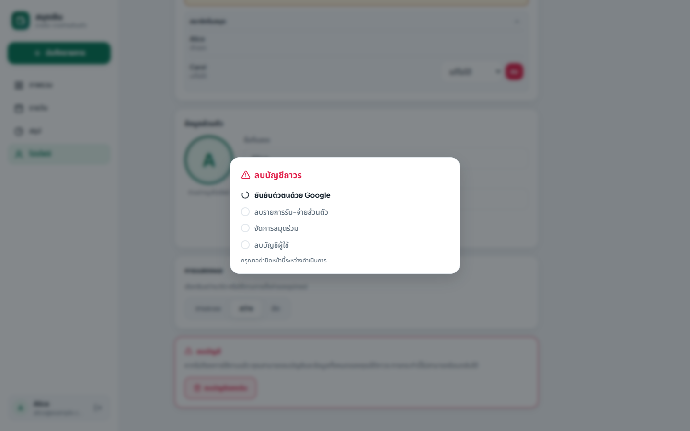 | **3. ดำเนินการทีละขั้น** ยืนยันตัวตนด้วย Google อีกครั้ง → ลบข้อมูลส่วนตัว → จัดการสมุดร่วม → ลบบัญชี |
| 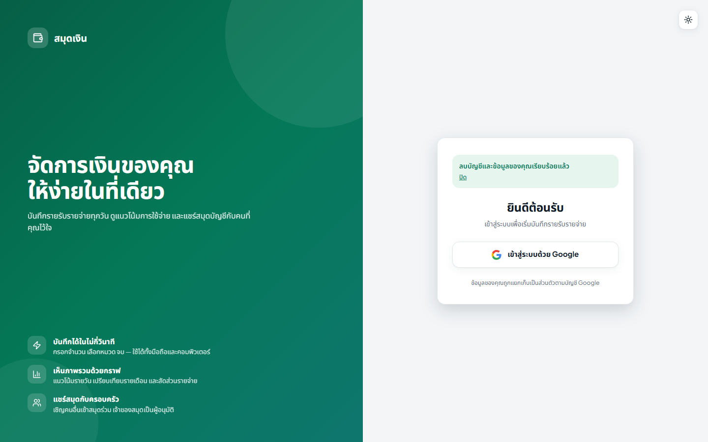 | **4. เสร็จสิ้น** กลับหน้า Login พร้อมข้อความยืนยัน |

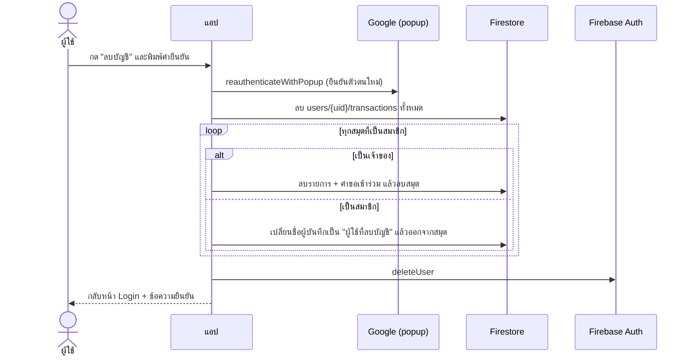

| ข้อมูล | สิ่งที่เกิดขึ้น |
|---|---|
| รายการรับ-จ่ายส่วนตัว | ลบถาวร |
| สมุดร่วมที่เป็นเจ้าของ | ลบถาวร (รวมรายการและคำขอเข้าร่วม) — สมาชิกคนอื่นจะเข้าไม่ได้อีก (แสดงชัดในหน้ายืนยัน) |
| สมุดร่วมที่เป็นสมาชิก | ถูกนำออกจากสมุด; รายการที่เคยบันทึกคงอยู่ในสมุดแต่ไม่แสดงตัวตน |
| บัญชีเข้าสู่ระบบ | ลบออกจาก Firebase Auth |

ทุกขั้นตอนทำซ้ำได้อย่างปลอดภัย (idempotent) หากขัดข้องกลางทางสามารถกดลองใหม่ได้ รายละเอียด: [docs/ACCOUNT-DELETION.md](docs/ACCOUNT-DELETION.md)

---

## 🚀 เริ่มต้นใช้งาน

### สิ่งที่ต้องมี
- Node.js 20+ และ npm
- โปรเจค [Firebase](https://console.firebase.google.com) (เปิด Authentication แบบ Google และ Firestore)
- (เฉพาะรันชุดทดสอบ rules) JDK 21+

### ติดตั้งและรัน

```bash
npm install
cp .env.example .env.local   # กรอกค่า VITE_FIREBASE_* จาก Project settings > Your apps > Web
npm run dev                  # http://localhost:5173
```

ค่า config ดึงได้ด้วย `firebase apps:sdkconfig WEB <appId>` แล้วแก้ `.firebaserc` ให้เป็น project id ของคุณ
อย่าลืมเพิ่มโดเมนที่ deploy ใน **Authentication → Settings → Authorized domains**

### สคริปต์

| คำสั่ง | คำอธิบาย |
|---|---|
| `npm run dev` | รัน dev server |
| `npm run build` | ตรวจ type แล้ว build production |
| `npm run lint` | ESLint |
| `npm run test:rules` | ทดสอบ Firestore Security Rules กับ Emulator (ต้องมี JDK 21+) |

### Deploy

```bash
npm run build
firebase deploy --only firestore:rules   # ขึ้น rules ก่อนเสมอ
firebase deploy --only hosting
```

> ยังไม่มี CI/CD ใน repo นี้ หากต้องการ auto-deploy ให้เพิ่ม workflow ด้วย `FirebaseExtended/action-hosting-deploy`
> และรัน `npm run test:rules` เป็นขั้นตอนตรวจก่อน deploy

---

## 📂 โครงสร้างโปรเจค

```
src/
 ├─ main.tsx · App.tsx · firebase.ts · theme.ts · types.ts · styles.css
 ├─ contexts/AuthContext.tsx        ล็อกอิน, ลบบัญชี
 ├─ lib/accountDeletion.ts          ตรรกะลบข้อมูลทั้งหมดของผู้ใช้ (แผน, ส่งออก CSV, purge)
 ├─ hooks/
 │   ├─ useTransactions.ts          รายการ (realtime)
 │   ├─ useBooks.ts                 สมุดร่วม, คำขอเข้าร่วม, จัดการสมาชิก
 │   └─ useAction.ts · useTheme.ts
 └─ components/
     ├─ Login · Layout · Dashboard · AddForm · DailyView · SummaryView
     └─ ProfileView · DeleteAccount · BookSwitcher · BookMembers · shared
tests/firestore.rules.test.ts        ทดสอบ Security Rules (Emulator)
firestore.rules · firebase.json      กฎความปลอดภัยและการตั้งค่า Firebase
public/privacy.html                  นโยบายความเป็นส่วนตัว (ใช้กับ App Store / Play Store)
docs/                                เอกสารเชิงลึกและภาพหน้าจอ
```

---

## 🗺️ แผนต่อยอด

- แอปมือถือ (Android/iOS) ด้วย Capacitor — ต้องเปลี่ยน Google Sign-in เป็นแบบ native และเพิ่ม Sign in with Apple
- ติดตั้ง CI (lint + build + `test:rules`)
- แก้ไขรายการที่บันทึกไว้, งบประมาณรายหมวด, ส่งออกข้อมูลทั้งหมด

## 🤝 Contributing · 📄 License

Fork แล้วเปิด Pull Request ได้เลย (กรุณารัน `npm run lint` และ `npm run test:rules` ก่อน)
โปรเจคนี้ยังไม่ได้ระบุ License — โปรดติดต่อเจ้าของ repository หากต้องการนำไปใช้ต่อ
